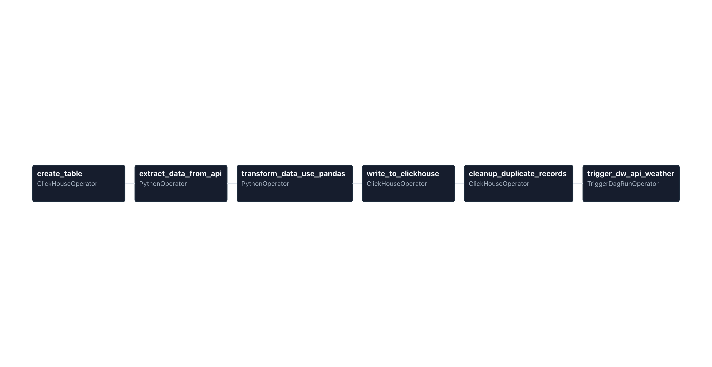
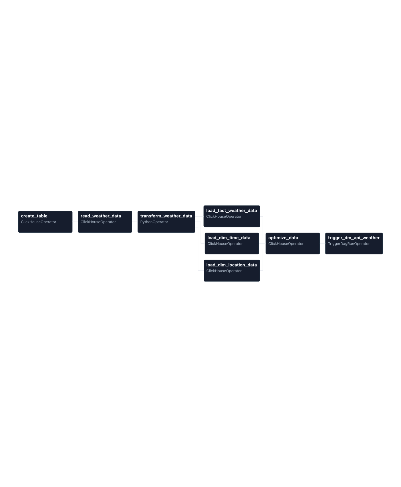
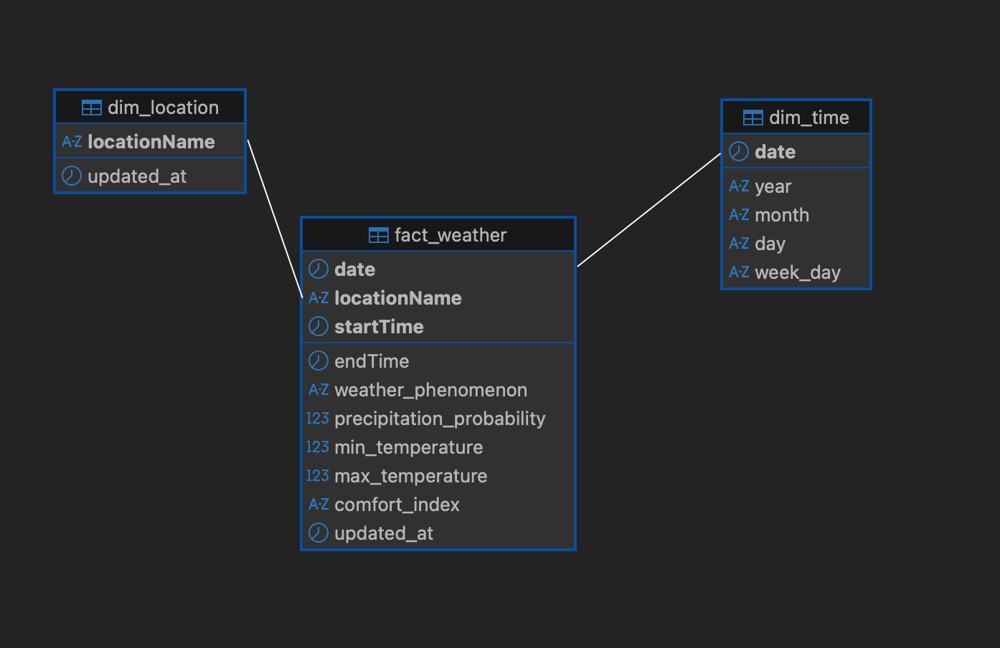
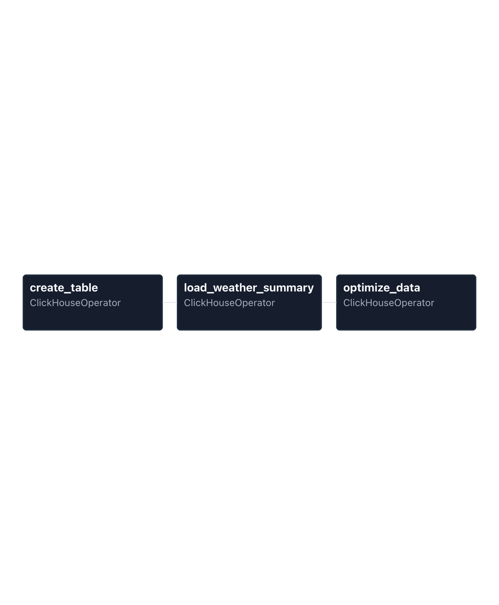

## 專案背景

在資料平台裡，內部交易數據通常不是唯一的訊號，外部情境（例如天氣、節日、事件）常常會直接影響業績或使用者行為。  
這個專案的目標，是把中央氣象署「今明 36 小時天氣預報」產品化成一條**可維運的資料管線**：

- 固定從 CWB API 抽取未來 36 小時的天氣預報
- 經過清洗與建模，分層寫入 ClickHouse 的 ODS / DW / DM
- 讓後續的報表、分析或模型可以直接 join 這個「天氣維度」

主要想解決的痛點是：

- 抓天氣資料完全用「手動」：臨時打 API、存檔、寫 SQL，流程不透明也難以重複
- 沒有任何**排程、監控與重跑機制**，資料錯了通常是事後在報表被發現
- 當分析或營運想驗證某一天數值是否合理時，缺乏可以回溯的「原始資料來源」

因此，我設計了一條以 **Apache Airflow 為核心** 的分層 ETL Pipeline，採用 **ODS → DW → DM 三階段架構**，  
在 Docker 環境中自動每 6 小時從 CWB API 抽取資料、轉換成結構化格式，最後寫入 ClickHouse。

[查看原始程式碼（GitHub）](https://github.com/Marvisyeh/ETL-with-Apache-Airflow)

---

## 架構決策：為什麼是 ODS / DW / DM？

選擇 ODS / DW / DM 分層，是基於這幾個考量：

### ODS（Operational Data Store）層：保留真實世界長什麼樣子

- **保留原始資料**：完整儲存 API 回傳資料，作為事後回溯與補跑的基礎
- **資料品質檢查**：在 ODS 層就先處理欄位缺失、格式錯誤、異常值
- **去重與一致性**：處理同一時間區間被重複寫入的狀況，避免影響下游

### DW（Data Warehouse）層：把資料變成分析友好的結構

- **結構化與維度化**：把 ODS 的原始資料，轉成星型模型（Star Schema）中的事實表 + 維度表
- **時間與地點維度**：建立 `dim_time`、`dim_location` 這類常用維度，讓查詢語意更清楚
- **針對查詢優化**：依據常見的分析需求（例如「城市 x 時間 x 指標」）設計欄位與索引策略

### DM（Data Mart）層：把數據包成「直接能上報表」的形狀

- **針對特定場景預先彙總**：例如「城市 x 時間區段的天氣摘要」、「日粒度的指標表」
- **簡化查詢邏輯**：下游報表或 Dashboard 不需要再寫太多 join，只要 select 即可

---

## 為什麼選擇 ClickHouse？

在這條 Pipeline 中：

- 寫入模式：每 6 小時批次寫入一批天氣資料，資料量隨時間累積
- 查詢模式：以時間 / 城市 / 指標為主的聚合查詢（典型 OLAP / 時序分析場景）

在這個前提下，我比較了幾個選項：

- **PostgreSQL**：團隊熟悉、泛用性高，但在長期累積大量時序資料後，聚合查詢與壓縮成本不是最理想
- **ClickHouse**：列式儲存 + 為 OLAP 設計，對「寫多讀多、讀是聚合查詢」非常友善

最後選擇 ClickHouse 的原因：

1. **聚合效能與壓縮比**：適合大量 append + 聚合的查詢模式，未來資料放大後仍能維持秒級查詢體驗  
2. **與批次 ETL 相容**：搭配 Airflow 做批次寫入，比起逐筆寫，能更好發揮 ClickHouse 優勢  
3. **成本與維運考量**：在可接受的硬體資源下，能取得不錯的效能與儲存成本平衡  

---

## 架構總覽：三條 DAG 如何協作

整個 Pipeline 分成三條 DAG，各自對應一層：

### ODS 層管線：`ods_api_weather` DAG

負責「資料取得與初步整理」：

1. **create_table**：建立 ODS 層的資料表結構
2. **extract_data_from_api**：從中央氣象署 API 取得原始資料
3. **transform_data_use_pandas**：將 JSON 轉換成結構化格式
4. **write_to_clickhouse**：寫入 ClickHouse ODS 層
5. **cleanup_duplicate_records**：清理重複記錄
6. **trigger_dw_api_weather**：觸發 DW 層 DAG 執行

### DW 層管線（`dw_api_weather` DAG）

負責「資料建模與維度化」：

1. **create_table**：建立 DW 層的維度表（`dim_time`、`dim_location`）
2. **read_weather_data**：從 ODS 層讀取當天的天氣資料
3. **transform_weather_data**：將 ODS 資料轉換成維度表格式
4. **load_dim_time_data**：載入時間維度資料
4. **load_dim_location_data**：載入地點維度資料
4. **load_fact_weather_data**：載入天氣事實資料
5. **optimize_data**：優化資料表，合併重複資料
6. **trigger_dm_api_weather**: 觸發 DM DAG

### DM 層管線（`dm_api_weather` DAG）

負責「將資料轉成報表可用」：

1. **create_table**：建立彙總表
2. **load_weather_summary**：從 DW 摘要資料，寫入 DM
3. **optimize_data**：優化資料表，合併重複資料

---

## 結果與影響

- 從「手動 script」變成「產品化的資料管線」：有排程、有監控、有 Log、有重跑策略
- 資料可回溯與可補跑：ODS 層保留原始資料，遇到問題時可以針對特定日期重新計算
- 結構化的天氣維度：DW / DM 層提供可直接 join 的維度與事實表，查詢語意清楚許多
- 效能與成本平衡：利用 ClickHouse 的列式儲存與批次寫入，在有限資源下維持不錯的查詢體驗
- 可擴充性：未來若要加入更多城市、更多氣象指標，只需在既有架構上增量擴充，而不是重寫整條 Pipeline

---

## 與資料倉儲架構的關聯

這條 Airflow Pipeline 並不是獨立存在的專案，而是資料平台中負責「資料取得與排程管理」的核心元件。

它與資料倉儲設計專案共同解決了三個問題：

- **資料如何穩定進來**（Airflow / ETL）
- **資料如何變得好用**（Data Warehouse / DataMart）
- **資料如何在失敗時被追蹤與修復**（Observability / Logging）

[查看原始程式碼（GitHub）](https://github.com/Marvisyeh/ETL-with-Apache-Airflow)

<!-- ## 使用技術

 -->