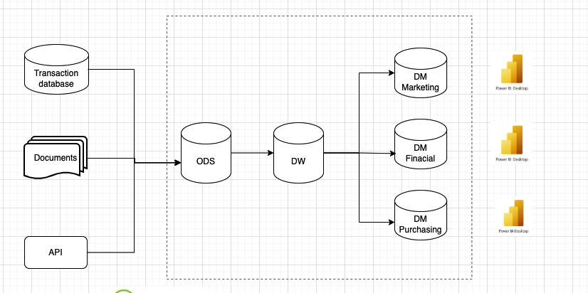
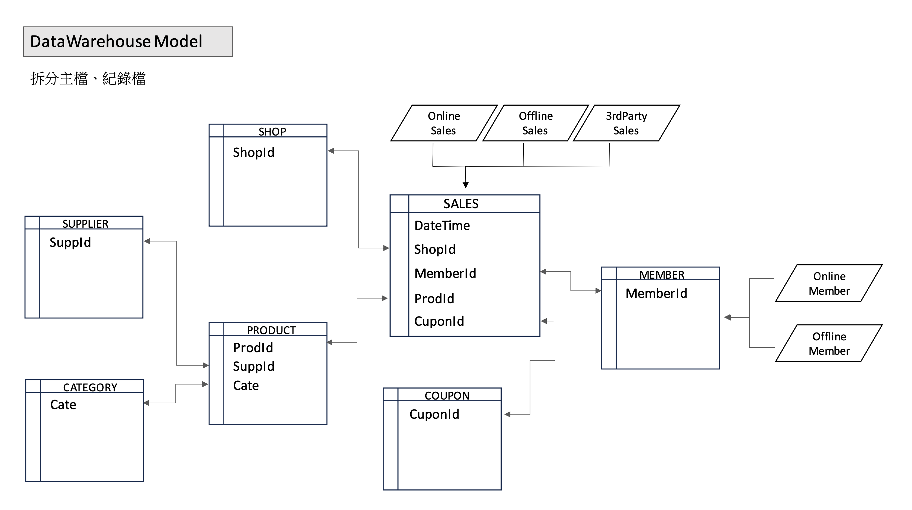

## 專案背景

> 本案例為真實生產經驗的抽象化整理，  
> 所有系統名稱、資料結構與數據皆已去識別與簡化，  
> 目的在說明設計思路與取捨，而非呈現特定公司實作細節。

在許多早期系統中，交易與分析常共用同一個資料庫，隨著分析需求成長，逐漸暴露出效能與維運問題：

- 後台報表查詢常常下複雜的 Aggregation / Join
- 高峰時段查詢會拖慢線上交易，造成系統延遲
- 想多加幾個分析報表，就會讓主資料庫越來越肥胖

為了**維持交易系統穩定**、同時又能滿足**越來越多的分析需求**，我規劃並實作了一套 **資料倉儲架構（Data Warehouse）**，把「交易」與「分析」清楚分開。

---

## 整體架構概覽（Data Flow）

整體流程可以拆成幾個層次來看：

1. **Source Layer（交易系統資料庫）**

   - 線上/實體系統運作，寫入交易訂單、使用者行為等資料
   - 盡量不在這一層做重型查詢，保護 OLTP 的效能

2. **ODS Layer（暫存層）**

   - 透過排程（例如 Airflow / Cron）定期抽取資料
   - ODS 同時作為原始資料快照，支援資料回補、問題排查與稽核需求。
   - 在這一層做基本的資料品質檢查（欄位缺失、格式錯誤、異常值等）

3. **Data Warehouse / DataMart Layer（主體層）**
   - 依照分析需求設計資料模型（例如 Star Schema）
   - 把交易明細整理成「事實表」與「維度表」
   - 提供報表、Dashboard、Data Scientist 直接查詢
   - 主要服務對象包含營運、行銷與資料分析人員，讓非工程角色也能直接透過 SQL 或 BI 工具取用資料。

這樣設計的好處是：

> 上游交易系統專心處理「寫入」，下游資料倉儲專心處理「查詢」，彼此透過管線串接，而不是互相干擾。

---

## 資料建模：從交易表到混合模型

在資料建模上，採用混合模型的做法，將資料拆成：

- **事實表（Fact Table）**：儲存交易明細，例如訂單金額、數量、折扣、時間等
- **維度表（Dimension Table）**：描述「誰、什麼、在哪裡、何時」，例如：
  - `dim_customer`：使用者屬性（年齡層、城市、註冊來源…）
  - `dim_product`：商品類別、品牌、價格帶…
  - `dim_date`：日期、週別、月份、季度等時間維度

這樣做有幾個關鍵好處：

1. **查詢語意更清楚、好理解**

   - 分析問題可以用「事實 + 維度」來思考，例如：
     > 不同城市（`dim_user.city`）在不同月份（`dim_date.month`）的銷售額（`fact_transaction.amount`）

2. **效能佳**

   - 常用查詢可以針對事實表與關鍵維度建立索引
   - 報表查詢集中在 DW/DM，不會回頭打爆交易 DB

3. **擴充容易**
   - 新增一個維度（例如通路 / 裝置類型）通常不會破壞既有查詢
   - 新的報表需求，常常只是在既有 Fact + Dimension 上重新組合

---

## ETL / ELT 流程設計

為了讓資料可以穩定從交易系統流向資料倉儲，我設計了多條固定的資料管線：

1. **抽取（Extract）**

   - 透過排程工具（可以是 Airflow、也可以是簡單的 Cron + Script）
   - 以時間區間（例如昨日、上一小時）的方式抽取增量資料
   - 把結果先寫入 Staging Table 或中繼檔案（CSV / Parquet）
   - 管線設計上支援可重跑（idempotent），即使某批次失敗，也能安全補跑不造成重複資料

2. **轉換（Transform）**

   - 清洗異常值、補齊必要欄位
   - 依據資料模型，把原始交易表轉成 Fact / Dimension 所需的欄位格式
   - 例如：把原始的狀態碼轉成業務看得懂的狀態（成功、取消、退款…）

3. **載入（Load）**
   - 對 Fact / Dimension Table 做 Insert / Upsert
   - 使用批次寫入的方式，降低對資料庫的壓力
   - 每次載入完成後，寫入 Log，記錄這批資料的時間區間與筆數

---

## 成效與改善

在導入這套資料倉儲架構後，我觀察到幾個明顯的改變（數字可依你實際情況調整）：

- 常見分析報表（例如日營收、用戶留存）查詢時間從數十秒縮短到數秒級
- 新增報表需求時，可以直接在資料倉儲上組合事實表與維度表，不必再和工程團隊爭取
- 整體數據結構更清楚，新人加入時比較容易理解「資料從哪裡來、可以怎麼用」

---

## 我的收穫與學習

這個資料倉儲專案，讓我在幾個面向上有更具體的體會：

1. **資料架構要從「問題」出發，而不是從「工具」出發**  
   先釐清常見的分析問題（例如 轉換率、留存、周轉等），再回頭設計 Fact / Dimension。

2. **分層是 Data Platform 的關鍵概念**  
   把 Source / Ods / Data WareHouse / DataMart 分清楚，可以大幅降低耦合度，也讓後續維護更輕鬆。

3. **資料品質與可觀測性要考慮**  
   不只是有管線、有表就好，還要同時觀察：
   - 今天的資料有沒有準時到？
   - 這一批資料筆數是不是異常？
   - 如果某天管線失敗，要怎麼補跑、怎麼回溯？

> 這個案例聚焦在資料架構與設計思路，
> 實際實作會依組織規模、資料量與資源限制有所取捨。

---

## 使用技術

