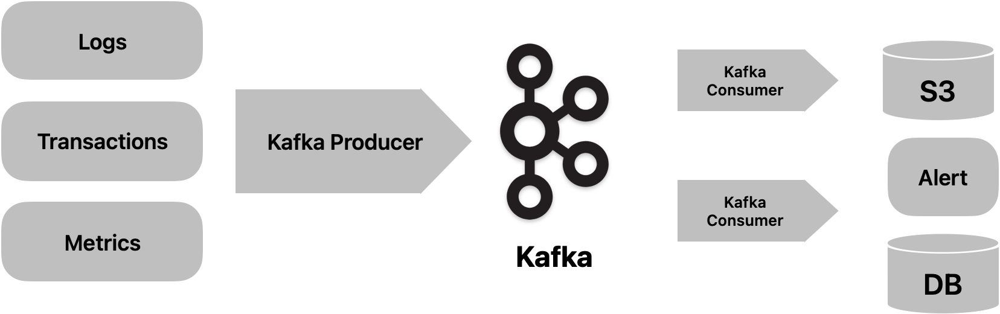

## 專案背景

在很多成長中的團隊裡，應用服務和資料平台越建越多：

- 多個後端服務，各自把 log 打到自己的檔案或 APM  
- 數據平台會再把部分 log / metrics 匯入資料倉儲做離線分析  
- 風控或合規團隊另外有一套報表或查詢系統追交易異常  

結果就是：**大家都有 log，但沒有一個地方可以「一次看清楚，正在發生哪些異常」**。

這帶來幾個典型痛點：

- 事件分散在不同系統，很難回答：「某個 user 在這 5 分鐘內，跨服務到底發生了什麼事？」  
- 線上告警（Discord / Slack）和離線儲存（S3 / Data Warehouse）之間，**沒有共同的事件來源與 schema**  
- 想要對「異常」做進一步分析或模型訓練，卻缺少一張「統一的 `anomaly_events` 表」可以直接查詢與 join  

這個專案的出發點，就是想實作一條「把異常事件統一起來」的 streaming pipeline：

- **即時性**：透過 Kafka + rule-based consumer，幾秒內判斷是否為異常，並發出 Discord 告警  
- **可追溯性**：所有原始事件先備份到 S3，異常事件整理後寫入 PostgreSQL `anomaly_events`，方便回放與分析  
- **統一視角**：用 FastAPI 暴露統一 API，React Dashboard 以一個畫面整合 logs / metrics / transactions 的異常資訊  

[查看原始程式碼（GitHub）](https://github.com/Marvisyeh/real-time-compliance)

---

## 系統架構與目前實作

整體來說，這是一條 **Kafka → S3 / PostgreSQL → FastAPI → React Dashboard** 的 streaming 管線，  
用來把多來源異常事件統一成一張 `anomaly_events` 表，並對外提供查詢與可視化介面。

在程式碼層面，目前已經實作並跑得起來的元件包含：

- **事件產生與消費**：  
  - 三個 Python producers：隨機產生 `logs` / `metrics` / `transactions` 事件並寫入 Kafka  
  - 兩個 consumers：`BackupS3Consumer`（寫 S3 備份）、`AnalysisConsumer`（規則判斷 + Discord 告警 + 寫入 PostgreSQL `anomaly_events`）  
- **儲存與遷移**：Alembic migration 已設定好，初始遷移會自動建立 `anomaly_events` 表  
- **API 層（FastAPI）**：`dashboard` / `events` 兩個模組，對外提供查詢與統計 API  
- **前端 Dashboard**：React + TypeScript + Tailwind，包含 Dashboard、Events 列表與 Event 詳細頁  
- **本地開發環境**：Docker Compose 一鍵啟動 Kafka（KRaft）、Postgres、API 服務、前端服務與開發用容器  

---

## 系統總覽：事件從哪裡來、要被誰用？

我把整個系統拆成五個角色，對應典型資料平台裡的幾個層次：

1. **Producers（事件產生）**  
   - 三個 Python producers 模擬 `logs` / `metrics` / `transactions`  
   - 以 JSON 格式持續將事件寫入 Kafka 對應的 topics  

2. **Consumers（處理與分流）**  
   - `BackupS3Consumer`：負責長期備援，把原始 JSON 依日期寫入 S3  
   - `AnalysisConsumer`：依事件類型套用規則，判斷異常、發 Discord 告警並寫入 Postgres  

3. **Storage 層**  
   - S3：原始事件的 data lake-ish 儲存，支援之後的 replay / offline 分析  
   - PostgreSQL：以 `anomaly_events` 為中心的結構化查詢介面  

4. **API 層（FastAPI）**  
   - `dashboard` 模組：提供總覽、timeline、服務彙總等 dashboard 資料  
   - `events` 模組：提供 anomaly events 的查詢、分頁與統計  

5. **觀測與呈現（React Dashboard）**  
   - 即時顯示異常事件趨勢、分佈與詳細內容  

---

## 架構決策：Kafka、S3、PostgreSQL 的分工

這個專案可以看成是一條縮小版的「異常事件管線」，刻意用 Kafka + S3 + PostgreSQL 各自負責不同角色：

- **Kafka**：作為單一事件匯流排（event bus），讓 producers 只需要把事件寫進 topic，下游可以各自以自己的節奏消費（備援、分析、實驗性消費者…）。  
- **S3**：偏向 data lake-ish 的角色，負責保存「原始事件」：方便回溯、補跑、做離線訓練或重新計算規則。  
- **PostgreSQL**：專心作為整理後的「異常事件事實表」，提供 API / Dashboard / 報表一個穩定可查詢、可 join 的 schema。  

相較於直接把所有 log 丟進單一 APM 或 ELK Stack，這個設計更貼近資料平台常見的責任分工：  
事件先進入 Kafka，再依用途被切成「長期備援（S3）」與「即時查詢（Postgres `anomaly_events`）」，最後再透過 API / Dashboard 對外提供統一視角。

---

## 資料流與事件生命週期

一個事件（例如一筆錯誤 log 或高金額交易）在系統裡的生命週期大致如下：

1. **產生（Produce）**  
   - Producer 將事件打到對應 Kafka topic：`logs`、`metrics` 或 `transactions`  

2. **備援（Backup to S3）**  
   - `BackupS3Consumer` 從這些 topics 消費原始 JSON  
   - 依日期與時間寫入 S3：`PREFIX/YYYYMMDD/<timestamp>.json`  
   - 目的：保留原始事件，支援 replay、offline 訓練與稽核需求  

3. **規則偵測（Rule-based Analysis）**  
   - `AnalysisConsumer` 依事件類型套用不同規則（與程式碼一致）：  
   - Logs：3 分鐘內 ERROR 數量暴增（例如 >= 20）、訊息包含 "failed"，或單一 user 錯誤在短時間內異常升高  
   - Metrics：CPU 長時間 >= 80%、latency > 1000ms，或兩者同時偏高  
   - Transactions：單筆金額 > 10000，或 5 分鐘內單一 user 交易頻率異常  
   - 若判定為異常：  
     - 觸發 Discord webhook 發送告警  
     - 轉成 `anomaly_events` 結構後寫入 PostgreSQL  

4. **查詢與統計（Query & Aggregation）**  
   - FastAPI 將 `anomaly_events` 上的查詢與統計封裝成穩定 API  
   - 包含：事件列表、單筆詳細、統計摘要、按時間/服務的分佈等  

5. **可視化與監控（Visualization & Monitoring）**  
   - React Dashboard 透過 API 取得資料並呈現  
   - 以圖表與清單形式給 SRE / 工程師 / 風控同一個「異常視角」  

---

## 規則引擎設計：為什麼先用 Rule-based？

在很多實務場景中，團隊一開始就想用 ML 做 anomaly detection，  
但實際落地時，rule-based 常常是**更好的第一步**：

- 各團隊（SRE、風控、產品）對規則的語意容易達成共識  
- 行為可預期、可解釋，對合規/稽核友善  
- 可以先透過規則累積帶標籤的異常事件，未來才有 ML 訓練資料  

在這個專案裡，我刻意將規則寫得「業務語意清楚」：

- log：在 3 分鐘內錯誤數暴增，或特定關鍵字出現  
- metric：CPU 長時間高於某個門檻 + latency 同時偏高  
- transaction：單筆或短時間內的金額/頻率異常  

這些規則都對應到現實世界會關心的問題，  
同時也讓之後要引入統計或 ML 模型時，有一個良好的 baseline 可以比較。

[查看原始程式碼（GitHub）](https://github.com/Marvisyeh/real-time-compliance)
